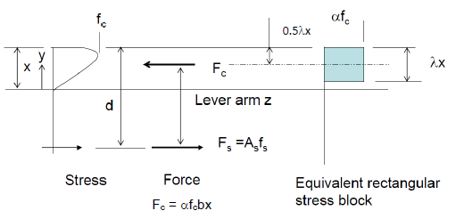

# Introduction

PyFEA is a finite element analysis (FEA) software written in Python language. It is divided into separate analyses for different structural engineering calculations. There are several available modules for different engineering calculations.

# 1. Global analysis

This a general purpose finite element analysis module, which could be used to derive element bending moments and axial forces. Please note, that geometric non-linearity is not available.

# 2. Section analysis

The external loads, including dead, live or wind forces, are resisted by internal energy stored in the structure. Depending on the distribution of forces, varying strains develop across the section. This results in a member to be subjected to bending moments and/or axial forces, which can be found using [global analysis](#1-Global-analysis). 

Section analysis allows to generate a M-N interaction curve, which defines the boundaries for combined bending moment and axial forces. Non-linear material properties are available, which allows to analyse variety of steel and concrete models.

## 2.1. Material models

This section defines how to incorporate material classes from _material.py_ module.

For each model, the parameters `plotting` and `title`  can be used to generate plots showing stress vs. strain diagrams.

### 2.1.1 con1

```python
materials.con1(ID, fc1, length, epsilon_t2 = 0.001, fc2_factor = 0.1, ft_factor = 1, characteristic = True,plotting=True,title="stl1")
```

|   Parameter    |         Type         |                       Description                       |
| :------------: | :------------------: | :-----------------------------------------------------: |
|       ID       |         str          |                  name of the material                   |
|      fc1       |      float/int       |                peak compressive strength                |
|     length     |      float/int       |                     element length                      |
|   epsilon_t2   |        float         |                 ultimate tensile strain                 |
|   ft_factor    | float in range (0,1) |            tensile strength reduction factor            |
| characteristic |         bool         | characteristic strength (True) or mean strength (False) |
|    plotting    |         bool         |               plot stress vs strain curve               |
|     title      |         str          |                    title of the plot                    |

_Con1_ is a trilinear concrete model, with optional tensile response and piecewise quadratic/cubic compressive and tensile responses.


Initial compressive response is defined by the parameter $\alpha_{c}$, which is based on $E_{c0}$ and $E_{c1}$. Elastic initial modulus $E_{c0}$ is based on the parabolic curve. $E_{c1}$ is the secant modulus from the origin to the peak compressive stress. If $\alpha > 0$, a quadratic initial compressive response is implied.

After the peak compressive strength is achieved, softening stage takes place up to the failure. To avoid convergence issues, residual compressive strength $f_{c2}$ is maintained after failure. User can specify the _fc2_factor_ as the fraction of the peak strength. This is taken as 10% by default $f_{c2} = 0.1f_{c1}$.

The input parameters are concrete cylinder strength $f_{c1}$ and element length $h$. It is assumed that the input strength $f_{c1}$ is the characteristic compressive strength $f_{ck}$. If mean strength $f_{cm}$ is used, set the input parameter $characteristic$ to False, which affects the calculations of the fracture energy $G_f$. Element length $h$ is used to determine crack-band width.

Most of the other parameters are calculated according to <em>CEB-FIP Model Code 1990 (MC 1990)</em>, <em>CEB-FIP Model Code 2010 (MC 2010)</em> as well as <em>Rijkswaterstaat Technical Document: Guidelines for Nonlinear Finite Element Analysis of Concrete Structures (RTD 2010)</em>. These formulas are based on the uniaxial compressive cylinder strength.

To avoid overestimating the cracking moment, tensile strength $f_t$ can be reduced using tensile reduction factor *ft_factor*. Tension strain at failure $\varepsilon_{t2}$ needs to be defined by the user, taken as 0.001 by default.

|                  Parameter                   |                           Formula                            | Units |     Reference      |
| :------------------------------------------: | :----------------------------------------------------------: | :---: | :----------------: |
|        Compressive cylinder strength         |                  $$f_{c} = 0.85f_{c,cube}$$                  |  MPa  |         NA         |
| Characteristic compressive cylinder strength |                          $$f_{ck}$$                          |  MPa  |         NA         |
|          Mean compressive strength           |                   $$f_{cm} = f_{ck} + 8$$                    |  MPa  | MC 1990 Eq. 2.1-1  |
|          Peak compressive strength           |                          $$f_{c1}$$                          |  MPa  |         NA         |
|        Residual compressive strength         |                          $$f_{c2}$$                          |  MPa  |         NA         |
|               Tensile strength               | $$f_t= ft_{factor} \cdot 0.3f_{cm}^{2/3} \leq C50$$ $$ f_t= ft_{factor} \cdot 2.12ln(1+0.1f_{cm}) > C50$$ |  MPa  | MC 2010 Eq. 5.1-3a |
|               Fracture energy                |           $$G_f = 73\frac{ f_{cm}^{0.18}}{1000} $$           | N/mm  | MC 2010 Eq. 5.1-9  |
|         Initial compressive modulus          |           $$E_{c0} = 21500\cdot(f_{cm}/10)^{1/3}$$           |  MPa  | MC 2010 Eq. 5.1-21 |
|               Poisson's ratio                |                           $$0.2$$                            |   -   |  MC 2010 5.1.7.3   |
|         Compressive fracture energy          |                     $$G_{c} = 250G_{f}$$                     | N/mm  |   RTD 2010 p. 11   |
|     Compressive strain at peak strength      |      $$\varepsilon_{c1} = \frac{5}{3}\frac{f_c}{E_0}$$       |   -   |   RTD 2010 p. 21   |
|          Secant compressive modulus          |        $$E_{c1} =  \frac{f_{c1}}{\varepsilon_{c1}}$$         |  MPa  |         NA         |
|           Initial tensile modulus            |                     $$E_{t1} = E_{c0}$$                      |  MPa  |         NA         |
|          Compressive failure strain          | $$\varepsilon_{c2} = \varepsilon_{c1} + \frac{3}{2}\frac{G_c}{hf_c}$$ |   -   |   RTD 2010 p. 21   |
|       Tensile strain at peak strength        |          $$\varepsilon_{t1} = \frac{f_t}{E_{t1}}$$           |   -   |         NA         |
|            Tensile failure strain            |        $$\varepsilon_{t2}=\frac{G_{f}}{h_{eq}f_{t}}$$        |   -   |   RTD 2010 p. 19   |
|     Initial compressive response factor      |          $$\alpha = \frac{E_{c0}-E_{c1}}{E_{c1}}$$           |   -   |   ADAPTIC manual   |


### 2.1.2 stl1

```python
materials.stl1(ID, E1, fy, fu, epsilon_u,plotting=True,title="stl1",tension=True,compression=True)
```

|  Parameter  |   Type    |                  Description                  |
| :---------: | :-------: | :-------------------------------------------: |
|     ID      |    str    |             name of the material              |
|     E1      | float/int |           initial elastic stiffness           |
|     fy      | float/int |                yield strength                 |
|     fu      | float/int |               ultimate strength               |
|  epsilon_u  |   float   |                ultimate strain                |
|  plotting   |   bool    |          plot stress vs strain curve          |
|    title    |    str    |               title of the plot               |
|   tension   |   bool    |   calculate the response in tension if True   |
| compression |   bool    | calculate the response in compression if True |

_Stl1_ is a bilinear elasto-plastic model with kinematic strain hardening, used for a uniaxial modelling of mild steel. The curve can be defined for compression and/or tension by setting the parameters `compression`, `tension` to `True` or `False`.

### 2.1.3 esb1



```python
materials.esb1(ID, fu, epsilon_u=0.0035, plotting=True, title="esb1", tension=True, compression=True)
```

| Parameter |   Type    |         Description         |
| :-------: | :-------: | :-------------------------: |
|    ID     |    str    |    name of the material     |
|    fu     | float/int |      ultimate strength      |
| epsilon_u |   float   |       ultimate strain       |
| plotting  |   bool    | plot stress vs strain curve |
|   title   |    str    |      title of the plot      |

This is a concrete material based on an equivalent stress block. The strength of the material is generally reduced by a factor $\alpha$, recommended as 0.85. The depth of the equivalent stress block $\lambda$ is 0.8. The peak compressive strain $\epsilon_u$ is recommended as 0.0035.


## 2.1.2 Sections

This chapter defines how to incorporate section classes from _sections.py_ module. This defines the section used in the analysis.

### 2.2.1 rcrs

Reinforced concrete rectangular section.

```python
sections.rss(ID, mat, b, d)
```

| Parameter  | Type  |               Description               |
| :--------: | :---: | :-------------------------------------: |
|     ID     |  str  |           name of the section           |
|     b      | float |           section width [mm]            |
|     d      | float |           section depth [mm]            |
| reinf_sect | list  | list of reinforcement layers, see below |

Reinforcement layers _reinf_ have to be input as a nested list as follows:

```python
reinf = [layer_1,layer_2,...layer_n]
layer_k = [no_bars, dia, dist]
```

where the layer k has the following parameters:

* _no_bars_ - number of bars
* _dia_ - diamater of the bars [mm]
* _dist_ - distance from the bottom of the section [mm]

### 2.2.2 rcts

Reinforced concrete T-section.

```python
sections.rcts(ID, reinf_mat, unconf_mat, conf_mat, Df, Dw, Bf, Bw, cover, links, reinf)
```

| Parameter  | Type  |               Description               |
| :--------: | :---: | :-------------------------------------: |
|     ID     |  str  |           name of the section           |
|     Df     | float |            flange depth [mm]            |
|     Dw     | float |           web thickness [mm]            |
|     Bf     | float |            flange depth [mm]            |
|     Bw     | float |           web thickness [mm]            |
| reinf_sect | list  | list of reinforcement layers, see below |

Reinforcement layers _reinf_ have to be input as a nested list as follows:

```python
reinf = [layer_1,layer_2,...layer_n]
layer_k = [no_bars, dia, dist]
```

where the layer k has the following parameters:

* _no_bars_ - number of bars
* _dia_ - diamater of the bars [mm]
* _dist_ - distance from the bottom of the section [mm]

## 2.3. M-N interaction curve

The designated section can be verified  using M-N interaction diagram. 

The members subjected to combined axial force and bending moments

MNclass object

### 2.3.1 Assign material properties to the section

```python
rc.MNclass(conMat,reinfMat,section)
```

| Parameter |  Type  |           Description           |
| :-------: | :----: | :-----------------------------: |
|  conMat   | object |   concrete material instance    |
| reinfMat  | object | reinforcement material instance |
|  section  | object |        section instance         |

Create a class instance by assigning concrete and reinforcement material models to the concrete section.

### 2.3.2 Extract section response at the given state

The MNclass instance has several methods that allow to extract the section resonse at the given state. They extract the total axial force and moment applied on the section at the given state.


| Parameter | Type  |                     Description                      |
| :-------: | :---: | :--------------------------------------------------: |
|   f_tot   | float | axial load applied on the section (tension positive) |
|   m_tot   | float |            moment applied on the section             |

#### 2.3.2.1 Response at the given top and bottom strains

```python
f_tot,m_tot=rc.MNclass(conMat,reinfMat,section).calc(eps0,epsH, plotting=True,n_layers=800)
```

| Parameter | Type  |                     Description                     |
| :-------: | :---: | :-------------------------------------------------: |
|   eps0    | float |      strain at depth x = 0  (tension positive)      |
|   epsH    | float |     strain at depth x = h    (tension positive)     |
| plotting  | bool  |    plot stresses and strains across the section     |
| n_layers  |  int  | number of fibres the section to be discretised into |

#### 2.3.2.2 Response at the given top strain and neutral axis depth

```python
rc.MNclass(conMat,reinfMat,section).calcX0(eps0,x_NA, plotting=True,n_layers=800)
```

| Parameter | Type  |                     Description                     |
| :-------: | :---: | :-------------------------------------------------: |
|   eps0    | float |    strain at depth x = 0     (tension positive)     |
|   x_NA    | float |   depth of the neutral axis    (tension positive)   |
| plotting  | bool  |    plot stresses and strains across the section     |
| n_layers  |  int  | number of fibres the section to be discretised into |

#### 2.3.2.3 Response at the given bottom strain and neutral axis depth

```python
f_tot,m_tot,f_s,f_con,eps_s,sigma_s=rc.MNclass(conMat,reinfMat,section).calcXH(epsh,x_NA, plotting=True,n_layers=800)
```

| Parameter | Type  |                     Description                     |
| :-------: | :---: | :-------------------------------------------------: |
|   epsH    | float |     strain at depth x = h    (tension positive)     |
|   x_NA    | float |   depth of the neutral axis   (tension positive)    |
| plotting  | bool  |    plot stresses and strains across the section     |
| n_layers  |  int  | number of fibres the section to be discretised into |

### 2.3.3. Generate M-N curve

```python
rc.MNclass(conMat,reinfMat,section).mnCurve(xRatio=[0.05,0.16,0.2,0.3,0.4,0.5,0.6,0.7,0.8,0.9,1,1.3,2,5,1E99],n_layers=100,epsU=-0.0035,reverseMoment=False,F_Ed=None,M_Ed=None)
```

|   Parameter   | Type  |                        Description                        |
| :-----------: | :---: | :-------------------------------------------------------: |
|    xRatio     | list  | neutral axis distances at which the reponse is calculated |
|   n_layers    |  int  |    number of fibres the section to be discretised into    |
|     epsU      | float |     assumed maximum compressive strain in the section     |
| reverseMoment | bool  |              reverse the moments on the plot              |
|     F_Ed      |  int  |    if not None plot a point with the given axial force    |
|     F_Ed      |  int  |      if not None plot a point with the given moment       |