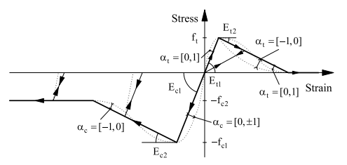
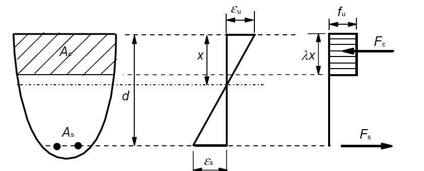

# Introduction

PyFEA is a finite element analysis (FEA) software written in Python language. It is divided into separate analyses for different structural engineering calculations. There are several available modules for different engineering calculations.

# 1. Global analysis

This a general purpose finite element analysis module, which could be used to derive element bending moments and axial forces. Please note, that geometric non-linearity is not available.

# 2. Section analysis

The external loads, including dead, live or wind forces, are resisted by internal energy stored in the structure. Depending on the distribution of forces, varying strains develop across the section. This results in a member to be subjected to bending moments and/or axial forces, which can be found using [global analysis](#1-Global-analysis). 

Section analysis allows to generate a M-N interaction curve, which defines the boundaries for combined bending moment and axial forces. Non-linear material properties are available, which enables to analyse variety of steel and concrete models.

## 2.1. Material models

This section defines how to incorporate material classes from _material.py_ module.

For each model, the parameters `plotting` and `title`  can be used to generate plots showing stress vs. strain diagrams.

### 2.1.1 con1

```python
materials.con1(Ec1,fc1,Ec2,fc2,Et1,ft,Et2,alphac,alphat,pset=0,crks=0)
```

| Parameter |         Type          |              Description               |
| :-------: | :-------------------: | :------------------------------------: |
|    Ec1    | float in range [0,∞]  |      secant compressive stiffness      |
|    fc1    | float in range [-∞,0] |       peak compressive strength        |
|    Ec2    | float in range [-∞,0] | secant compressive softening stiffness |
|    fc2    | float in range [-∞,0] |     residual compressive strength      |
|    Et1    | float in range [0,∞]  |        secant tensile stiffness        |
|    ft     | float in range [0,∞]  |         peak tensile strength          |
|    Et2    | float in range [-∞,0] |   tensile softening secant stiffness   |
|  alphac   | float in range [-1,1] |     compressive response parameter     |
|  alphat   | float in range [-1,1] |       tensile response parameter       |
|   pset    |         float         |     plastic strain in compression      |
|   crks    |         float         |       cracking strain in tension       |




This is a trilinear concrete model, with optional quadratic and cubic overlays.

$\alpha_c = [ 1, 1]$ and $\alpha_t = [ 1, 1]$. 

$|\alpha_c| \neq  0$ corresponds to a quadratic initial compressive branch, with $\alpha_c = \pm 1$ corresponding to a zero slope at $f_{c1}$.

$\alpha_c < 0$ corresponds to a cubic post-peak softening branch, with $\alpha_c = -1$ corresponsing to zero slopes at $f_{c1}$ and $f_{c2}$. 

$\alpha_t > 0$ corresponds to a quadratic initial tensile banch and a cubic post-peak softening branch, with $\alpha_t = 1$ corresponding to zero slopes at $f_{t}$. and the end of the softening branch. 

$\alpha_t < 0$ corresponds to a quadratic post-peak softening branch, with $\alpha_t = -1$ corresponding to a zero slopes at the end of this branch

#### 2.1.1.1 con1gen

The input parameters for *con1* material can be cumbersome to obtain. Therefore, *con1gen* subclass can be used to generate concrete properties based on its compressive strength  $f_{c}$ and element length  $h$.

It is assumed that the input strength $f_{c}$ is the characteristic compressive strength $f_{ck}$. If mean strength $f_{cm}$ is used, set the input parameter $characteristic$ to $False$, which affects the calculations of the fracture energy $G_f$. Element length $h$ is used to determine crack-band width.

Most of the other parameters are calculated according to <em>CEB-FIP Model Code 1990 (MC 1990)</em>, <em>CEB-FIP Model Code 2010 (MC 2010)</em> as well as <em>Rijkswaterstaat Technical Document: Guidelines for Nonlinear Finite Element Analysis of Concrete Structures (RTD 2010)</em>. These formulas are based on the uniaxial compressive cylinder strength.

|                  Parameter                   |                           Formula                            | Units |     Reference      |
| :------------------------------------------: | :----------------------------------------------------------: | :---: | :----------------: |
|        Compressive cylinder strength         |                  $$f_{c} = 0.85f_{c,cube}$$                  |  MPa  |         NA         |
| Characteristic compressive cylinder strength |                          $$f_{ck}$$                          |  MPa  |         NA         |
|          Mean compressive strength           |                   $$f_{cm} = f_{ck} + 8$$                    |  MPa  | MC 1990 Eq. 2.1-1  |
|          Peak compressive strength           |                          $$f_{c1}$$                          |  MPa  |         NA         |
|        Residual compressive strength         |                          $$f_{c2}$$                          |  MPa  |         NA         |
|               Tensile strength               | $$f_t= ft_{factor} \cdot 0.3f_{cm}^{2/3} \leq C50$$ $$ f_t= ft_{factor} \cdot 2.12ln(1+0.1f_{cm}) > C50$$ |  MPa  | MC 2010 Eq. 5.1-3a |
|               Fracture energy                |           $$G_f = 73\frac{ f_{cm}^{0.18}}{1000} $$           | N/mm  | MC 2010 Eq. 5.1-9  |
|         Initial compressive modulus          |           $$E_{c0} = 21500\cdot(f_{cm}/10)^{1/3}$$           |  MPa  | MC 2010 Eq. 5.1-21 |
|               Poisson's ratio                |                           $$0.2$$                            |   -   |  MC 2010 5.1.7.3   |
|         Compressive fracture energy          |                     $$G_{c} = 250G_{f}$$                     | N/mm  |   RTD 2010 p. 11   |
|     Compressive strain at peak strength      |      $$\varepsilon_{c1} = \frac{5}{3}\frac{f_c}{E_0}$$       |   -   |   RTD 2010 p. 21   |
|          Secant compressive modulus          |        $$E_{c1} =  \frac{f_{c1}}{\varepsilon_{c1}}$$         |  MPa  |         NA         |
|           Initial tensile modulus            |                     $$E_{t1} = E_{c0}$$                      |  MPa  |         NA         |
|          Compressive failure strain          | $$\varepsilon_{c2} = \varepsilon_{c1} + \frac{3}{2}\frac{G_c}{hf_c}$$ |   -   |   RTD 2010 p. 21   |
|       Tensile strain at peak strength        |          $$\varepsilon_{t1} = \frac{f_t}{E_{t1}}$$           |   -   |         NA         |
|            Tensile failure strain            | $$\varepsilon_{t2}$$ is set so that the area under the tensile curve is $\frac{G_f}{h}$ |   -   |   RTD 2010 p. 17   |
|         Compressive response factor          |         $$\alpha_c = \frac{E_{c0}-E_{c1}}{E_{c1}}$$          |   -   |                    |
|           Tensile response factor            |                      $$\alpha_t = -1$$                       |   -   |                    |


### 2.1.2 epm1

```python
materials.epm1(E1, fy, fu, epsilon_u,tension=True,compression=True)
```

|  Parameter  |   Type    |                  Description                  |
| :---------: | :-------: | :-------------------------------------------: |
|     E1      | float/int |           initial elastic stiffness           |
|     fy      | float/int |                yield strength                 |
|     fu      | float/int |               ultimate strength               |
|  epsilon_u  |   float   |                ultimate strain                |
|   tension   |   bool    |   calculate the response in tension if True   |
| compression |   bool    | calculate the response in compression if True |

This is a bilinear elasto-plastic model with kinematic strain hardening, typically used for a uniaxial modelling of mild steel. The curve can be defined for compression and/or tension by setting the parameters `compression`, `tension` to `True` or `False`.

### 2.1.3 esb1



```python
materials.esb1(fu, lamb, epsilon_u, tension=True, compression=True)
```

| Parameter |   Type    |                       Description                       |
| :-------: | :-------: | :-----------------------------------------------------: |
|    fu     | float/int |                    ultimate strength                    |
|  lambda   |   float   | ratio of the depth of the equivalent stress block to NA |
| epsilon_u |   float   |                     ultimate strain                     |

This is a material based on an equivalent stress block for reinforced concrete sections design. This is 

For Eurocode 2 design the following properties are recommended:

* The strength of the material is equal to the compressive strength reduced by 0.85 $f_u=\alpha f_{cd}=0.85f_{cd}$. 
* The ratio of the depth of the equivalent stress block to NA is taken as $\lambda =0.8$. 
* The peak compressive strain is $\epsilon_u = 0.0035$ .

### 2.1.4 Methods

All the materials have the same methods available. Any type of material is referred to as `materials.type` in the code below.

#### 2.1.4.1 stress

```python
materials.type.plotting(strain)
```

| Parameter | Type  |             Description              |
| :-------: | :---: | :----------------------------------: |
|  strain   | float | strain at which stress is calculated |

This method calculates the stresses at given strain.

#### 2.1.4.2 plot

```python
materials.sections.plot(strain,title='',lineType='-',xlim=(None,None),ylim=(None,None))
```

| Parameter |  Type  |            Description             |
| :-------: | :----: | :--------------------------------: |
|  strain   | vector | strain for which stress is plotted |
|   title   |  str   |         title of the plot          |
| lineType  |  bool  |             line type              |
|   xlim    | tuple  |           x-axis limits            |
|   ylim    | tuple  |           y-axis limits            |

This method plots the material response for the given strain vector.

#### 2.1.4.3 basicCurve

```python
materials.sections.basicCurve(title='',lineType='-',xlim=(None,None),ylim=(None,None))
```

| Parameter | Type  |    Description    |
| :-------: | :---: | :---------------: |
|   title   |  str  | title of the plot |
| lineType  | bool  |     line type     |
|   xlim    | tuple |   x-axis limits   |
|   ylim    | tuple |   y-axis limits   |

This method is similar to `materials.sections.plot()` but plot the entire material material response, without the need to specify the strain vector.

## 2.1.2 Sections

This chapter defines how to incorporate section classes from _sections.py_ module.

### 2.2.1 rcrs

Reinforced concrete rectangular section.

```python
sections.rss(ID, mat, b, d)
```

| Parameter  | Type  |               Description               |
| :--------: | :---: | :-------------------------------------: |
|     ID     |  str  |           name of the section           |
|     b      | float |           section width [mm]            |
|     d      | float |           section depth [mm]            |
| reinf_sect | list  | list of reinforcement layers, see below |

Reinforcement layers _reinf_ have to be input as a nested list as follows:

```python
reinf = [layer_1,layer_2,...layer_n]
layer_k = [no_bars, dia, dist]
```

where the layer k has the following parameters:

* _no_bars_ - number of bars
* _dia_ - diamater of the bars [mm]
* _dist_ - distance from the bottom of the section [mm]

### 2.2.2 rcts

Reinforced concrete T-section.

```python
sections.rcts(Df, Dw, Bf, Bw, reinf_sect)
```

| Parameter  | Type  |               Description               |
| :--------: | :---: | :-------------------------------------: |
|     Df     | float |            flange depth [mm]            |
|     Dw     | float |           web thickness [mm]            |
|     Bf     | float |            flange depth [mm]            |
|     Bw     | float |           web thickness [mm]            |
| reinf_sect | list  | list of reinforcement layers, see below |

Reinforcement layers _reinf_ have to be input as a nested list as follows:

```python
reinf = [layer_1,layer_2,...layer_n]
layer_k = [no_bars, dia, dist]
```

where the layer *k* has the following parameters:

* _no_bars_ - number of bars
* _dia_ - diamater of the bars [mm]
* _dist_ - distance from the bottom of the section [mm]

### 2.2.3 Methods

All the sections have the same methods available. Any type of section is referred to as `sections.type` in the code below.

#### 2.2.3.1 plotting

```python
materials.sections.plotting(title='section layout',reverse=False)
```

| Parameter | Type |          Description          |
| :-------: | :--: | :---------------------------: |
|   title   | str  |       title of the plot       |
|  reverse  | bool | plots the section upside down |

This method plots the section layout. In case of rc sections, the reinforcement is uniformly distributed across its width and is only informative. 

## 2.3. Groups

A group is composed of a section and corresponding materials and can be defined using *groups* module. This allows to carry out a strain / stress analysis. 

### 2.3.1 rc

```python
groups.rc(concr,reinf,section)
```

| Parameter |  Type  |           Description           |
| :-------: | :----: | :-----------------------------: |
|   concr   | object |   concrete material instance    |
|   reinf   | object | reinforcement material instance |
|  section  | object |        section instance         |

A reinforced concrete section can be instantiated using *rc* class. This assigns concrete and reinforcement material models to the concrete section.

#### 2.3.1.1 Extract section response at the given state

The rc instance has several methods that allow to extract the section response at the given state. These extract the total axial force and moment applied on the section at the given stain distribution.


| Parameter | Type  |                     Description                      |
| :-------: | :---: | :--------------------------------------------------: |
|   f_tot   | float | axial load applied on the section (tension positive) |
|   m_tot   | float |            moment applied on the section             |

##### 2.3.1.1.1 Response at the given top and bottom strains

```python
f_tot,m_tot=groups.rc(concr,reinf,section).calc(eps0,epsH, plotting=True,n_layers=800)
```

| Parameter | Type  |                     Description                     |
| :-------: | :---: | :-------------------------------------------------: |
|   eps0    | float |      strain at depth x = 0 (tension positive)       |
|   epsH    | float |      strain at depth x = h (tension positive)       |
| plotting  | bool  |    plot stresses and strains across the section     |
| n_layers  |  int  | number of fibres the section to be discretised into |

##### 2.3.1.1.2 Response at the given top strain and neutral axis depth

```python
f_tot,m_tot=groups.rc(concr,reinf,section).calcX0(eps0,x_NA, plotting=True,n_layers=800)
```

| Parameter | Type  |                     Description                     |
| :-------: | :---: | :-------------------------------------------------: |
|   eps0    | float |      strain at depth x = 0 (tension positive)       |
|   x_NA    | float |    depth of the neutral axis (tension positive)     |
| plotting  | bool  |    plot stresses and strains across the section     |
| n_layers  |  int  | number of fibres the section to be discretised into |

##### 2.3.1.1.3 Response at the given bottom strain and neutral axis depth

```python
f_tot,m_tot=groups.rc(concr,reinf,section).calcXH(epsh,x_NA, plotting=True,n_layers=800)
```

| Parameter | Type  |                     Description                     |
| :-------: | :---: | :-------------------------------------------------: |
|   epsH    | float |      strain at depth x = h (tension positive)       |
|   x_NA    | float |    depth of the neutral axis (tension positive)     |
| plotting  | bool  |    plot stresses and strains across the section     |
| n_layers  |  int  | number of fibres the section to be discretised into |

### 2.3.1.2 Generate M-N curve

```python
groups.rc(concr,reinf,section).mnCurve(xRatio=[0.16,0.2,0.3,0.4,0.5,0.8,0.9,1,1E99],n_layers=100,epsU=-0.0035,reverseMoment=False,points=None,r2kPath=None,legend=False,labels=None)
```

|   Parameter   | Type  |                         Description                          |
| :-----------: | :---: | :----------------------------------------------------------: |
|    xRatio     | list  |  neutral axis distances at which the response is calculated  |
|   n_layers    |  int  |     number of fibres the section to be discretised into      |
|     epsU      | float |      assumed maximum compressive strain in the section       |
| reverseMoment | bool  |           reverse the moments on the plot (x-axis)           |
|    points     | list  | if not `None` plot points with the given axial force and bending moment in a format `points = [[M1,F1],[M2,F2]]` |
|    r2kPath    |  int  | if not `None` this provides a path to csv file to plot another M-N curve in a format `r2kPath="file.csv"` |
|    legend     | bool  |                        plot a legend                         |
|    labels     | list  | list of labels for the legend in a format `labels = ['label 1','label 2']` |

This method generates the M-N interaction diagram.

There is an option to overplot another M-N curve calculated in a different way using other commercial software, by providing a path to .csv file in *r2kPath* attribute.